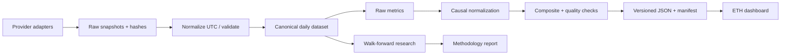

# Kế hoạch xây dựng chỉ số chu kỳ ETH theo mô hình CBBI

Ngày lập: **2026-09-29**. Phiên bản kế hoạch: **1.0**. Trạng thái: **PROPOSED / implementation not started**.

Tài liệu này đủ để triển khai theo từng task mà không cần lịch sử cuộc trò chuyện. Các mặc định dưới đây là đề xuất kỹ thuật để bắt đầu; không phải phương pháp đã chứng minh hiệu quả. Bằng chứng bên ngoài nằm trong [RESEARCH.md](RESEARCH.md), tiến độ thực hiện nằm trong [HANDOFF.md](HANDOFF.md).

## 1. Mục tiêu và cách hiểu “giống hệt”

Xây dựng một sản phẩm phục vụ ETH có cơ chế sử dụng tương tự CBBI: nhìn một điểm tổng hợp, đối chiếu với giá và các chu kỳ trước, xem đóng góp của từng metric, thử bật/tắt các thành phần và đọc phương pháp.

| Khía cạnh | Mức tương đồng cần đạt | Điều chỉnh bắt buộc |
|---|---|---|
| Giao diện và thao tác | Điểm nổi bật, lịch sử, rainbow price, metric cards, toggle, FAQ | Tên riêng, nội dung ETH, trạng thái dữ liệu và version |
| Cấu trúc tính toán | Raw metric → chuẩn hóa 0–100 → tổng hợp | Hiệu chỉnh riêng cho ETH, không dùng tham số BTC một cách mặc định |
| Số metric | Mục tiêu nghiên cứu 9 thành phần | Chỉ đưa vào điểm chính thức khi có dữ liệu và kiểm định; bản đầu có ít hơn |
| Ý nghĩa điểm | Mức nóng/lạnh chu kỳ | Không phải xác suất tạo đỉnh, lệnh mua/bán hoặc dự đoán ngày/giá |
| Lịch sử | Có thể xem toàn bộ vùng dữ liệu hợp lệ | Công bố warm-up, thay đổi phương pháp và dữ liệu hồi cứu |
| Mã nguồn | Minh bạch phương pháp và cách tái tạo | Chọn viết mới mặc định; nếu tái sử dụng mã upstream phải xử lý license |

**Không thể cam kết một bản sao toán học 1:1 của 9 metric BTC cho ETH.** Một số đại lượng phụ thuộc cơ chế đào coin hoặc UTXO không có tương đương trực tiếp. ETH chuyển sang PoS ngày 2022-09-15; lịch sử ETH cũng ngắn hơn. [The Merge](https://ethereum.org/roadmap/merge/)

### 1.1 Phạm vi theo phiên bản

- `core-v0.1`: engine và dashboard thử nghiệm, 4 thành phần E1/E5/E6/E7, dữ liệu ngày, lịch sử có version, không yêu cầu khóa trả phí để bắt đầu nghiên cứu.
- `extended-v0.x`: nghiên cứu đủ 9 vị trí trong ma trận; thêm thành phần theo dữ liệu, tính độc lập và hiệu quả ngoài mẫu. Nếu một vị trí không đạt, lưu quyết định loại bỏ hoặc thay thế, không bịa dữ liệu.
- `v1.0`: phương pháp đã khóa, vận hành shadow ít nhất 30 ngày, hoàn thành các cổng nghiệm thu, đủ tài liệu và quyền sử dụng dữ liệu cho hình thức phát hành đã chọn.
- Ngoài phạm vi ban đầu: giao dịch tự động, khuyến nghị cá nhân, đăng nhập, thanh toán, cảnh báo gửi ra ngoài, app mobile và tự vận hành archive node Ethereum.

## 2. Những gì đã xác minh về CBBI gốc

Website liệt kê 9 metric. Mã nguồn đã đối chiếu tại commit `efd6dcf08b9b8619c63b8669dee0990b4f076aac`: từng metric bị chặn về [0,1], sau đó `Confidence` được tính bằng trung bình ngang; NaN được chuyển thành null trước phép tổng hợp. Không nên suy ra toàn bộ thuật toán chỉ từ tên metric. [main.py tại commit đã đọc](https://github.com/Zaczero/CBBI/blob/efd6dcf08b9b8619c63b8669dee0990b4f076aac/main.py)

FAQ mô tả các đường hồi quy dùng để điều chỉnh theo chu kỳ, khả năng hiệu chỉnh lại lịch sử và việc bật/tắt metric. FAQ ghi cập nhật hai lần mỗi ngày. Vì vậy sản phẩm ETH dùng dữ liệu ngày với lịch công bố rõ ràng là đủ cho bản đầu. [FAQ](https://colintalkscrypto.com/cbbi/faq.html)

Lưu ý khi tái hiện: FAQ và mã nguồn có thể khác nhau ở chi tiết clipping hoặc phiên bản. Khi cần so sánh số học, dùng commit cùng snapshot dữ liệu; không dùng mô tả marketing làm đặc tả kiểm thử. Chưa kiểm tra giao diện gốc ở mức pixel hoặc chạy engine BTC để tái lập một giá trị live.

## 3. Ma trận 9 metric và hướng chuyển sang ETH

Các công thức ETH ở đây là **đề xuất mới**, không được mô tả là công thức chính thức của CBBI hay của nhà cung cấp.

| ID | Metric CBBI | Ứng viên ETH | Cách xử lý | Mức sẵn sàng |
|---|---|---|---|---|
| E1 | Pi Cycle Top | ETH MA Cycle Stretch | `ln(SMA111(P)/(2*SMA350(P)))`; dùng như độ lệch xu hướng | Core; kiểm định lại ý nghĩa, không tuyên bố giao cắt báo đỉnh ETH |
| E2 | RUPL / NUPL | ETH NUPL dẫn xuất | `1 - 1/MVRV`; thuộc cùng nhóm định giá với E7 | Diagnostic trước; không thêm phiếu độc lập vào Core |
| E3 | RHODL Ratio | Tỷ lệ realized value nhóm trẻ/già | Cần age bands theo phương pháp account-based rõ ràng | R&D; chưa xác minh nguồn ETH, gói API hay công thức phù hợp |
| E4 | Puell Multiple | ETH Fee Activity Multiple | Cường độ phí tương đối; không gọi là Puell | R&D; nguồn phí chưa truy cập được ở probe Community |
| E5 | 2 Year Moving Average | ETH 2Y MA Stretch | `ln(P/SMA730(P))` | Core; chấp nhận warm-up dài |
| E6 | Bitcoin Trolololo Trend | ETH Log Trend Deviation | Hồi quy nhân quả riêng trên lịch sử ETH | Core; không mang hệ số BTC sang |
| E7 | MVRV Z-Score | ETH MVRV Z nhân quả | Market cap, realized cap dẫn xuất, độ lệch chuẩn quá khứ | Core; phương pháp tài khoản của provider phải được ghi rõ |
| E8 | Reserve Risk | ETH Dormancy / Spending proxy | Cần định nghĩa tuổi coin và chuyển nội bộ/tài khoản | R&D; không gắn nhãn Reserve Risk chính xác |
| E9 | Top Cap vs CVDD | ETH NVT proxy | Vốn hóa so với giá trị chuyển ETH đã điều chỉnh | R&D; thay thế khái niệm, không phải CVDD |

E3/E8 chưa đủ đặc tả để code sản xuất. Task nghiên cứu phải kết thúc bằng công thức, endpoint, đơn vị, lag, warm-up, chiều tín hiệu và đánh giá sai lệch; nếu không đạt thì loại. Không kéo dài dự án vô hạn chỉ để đủ số 9.

### 3.1 Sự phụ thuộc giữa các metric

E1/E5/E6 đều dùng giá. E2 và E7 dùng cùng họ realized capitalization. Với E2, `NUPL = 1 - 1/MVRV` là biến đổi đơn điệu khi MVRV > 0; thêm cả hai không tạo hai bằng chứng độc lập. Core dùng trọng số theo nhóm để hạn chế đếm lặp. Đây là lựa chọn thiết kế cần đánh giá, không phải bảo đảm loại bỏ tương quan.

### 3.2 Các đặc điểm ETH cần đưa vào nghiên cứu

- Account-based khác UTXO: hợp đồng, chuyển giữa ví của cùng người, bridge và staking có thể thay đổi “lần di chuyển cuối”. Realized cap là đại lượng theo phương pháp provider, không phải sổ chi phí mua thực của toàn bộ nhà đầu tư. [Phương pháp realized cap](https://github.com/coinmetrics/docs-website/blob/master/asset-metrics/market/caprealusd.md)
- London/EIP-1559, Merge, Shapella và Dencun là các mốc cần phân đoạn khi đánh giá. Ghi ngày chính xác từ [lịch nâng cấp Ethereum](https://ethereum.org/ethereum-forks/) vào cấu hình sự kiện trước khi chạy báo cáo.
- Không nối doanh thu miner PoW và validator PoS thành cùng một series rồi giữ nguyên chuẩn hóa. Net issuance có thể âm nên không dùng làm mẫu số Puell thay thế.
- Fee giảm có thể liên quan dịch chuyển hoạt động sang L2; phí L1 không đại diện hoàn toàn cho nhu cầu hệ sinh thái. Không mặc định phí thấp là thị trường lạnh.
- Bản đầu định nghĩa tài sản là native ETH mainnet; không cộng vốn hóa WETH/LST/L2 vào supply để tránh đếm trùng.

## 4. Đặc tả toán học Core v0.1

### 4.1 Quy ước chung

`t` là ngày quan sát UTC, `P_t` là giá USD cuối kỳ theo một provider, `M_t` là market cap cùng phương pháp, `V_t` là MVRV. `SMA_n` dùng n ngày lịch liên tiếp, gồm ngày t, và yêu cầu đủ n giá trị hợp lệ. Dữ liệu chưa đóng ngày hoặc chưa sẵn có không được đưa vào lần tính chính thức.

Giữ nguyên `source_timestamp`; adapter phải xác minh timestamp provider chỉ đầu kỳ hay cuối kỳ và ánh xạ thành `observation_date`, `period_end_utc`. Không mặc định timestamp 00:00 là giá có thể giao dịch ngay đầu ngày đó.

Mọi cửa sổ dùng index ngày đã reindex theo lịch UTC, không dùng “n dòng” trên dữ liệu có ngày bị thiếu. Mọi log là log tự nhiên. Không round trước khi tổng hợp.

### 4.2 Công thức raw

| Metric ID | Công thức và thông số khởi đầu |
|---|---|
| `ma_cycle` (E1) | `x_t = ln(SMA111(P)_t / (2 * SMA350(P)_t))` |
| `ma_2y` (E5) | `x_t = ln(P_t / SMA730(P)_t)` |
| `log_trend` (E6) | `age_t = 1 + days(t - first_valid_price_date)`; với `u < t`, fit OLS `ln(P_u) = a_t + b_t*ln(age_u)` trên mọi giá hợp lệ trước t, tối thiểu 730 quan sát; `x_t = ln(P_t) - (a_t + b_t*ln(age_t))` |
| `mvrv_z` (E7) | `R_t = M_t/V_t`; `sigma_t = std(M_u, u<t, ddof=0)`, tối thiểu 365 quan sát; `x_t = (M_t-R_t)/sigma_t` |

Ngày gốc E6 được khóa theo data manifest của version; không đổi khi sửa một dòng đầu lịch sử. Hệ số E6 fit lại ở mỗi t chỉ từ quá khứ, và raw feature của các ngày cũ không tính lại bằng hệ số hiện tại. `R_t` phải mang nhãn `derived_realized_cap`, không giả làm trường trực tiếp tải từ provider.

MVRV chuẩn được Coin Metrics định nghĩa bằng market cap/realized cap; phép suy ra trên là đại số từ định nghĩa này. Cách chọn cửa sổ sigma và chuẩn hóa của dự án là đề xuất riêng. [Định nghĩa vốn hóa và MVRV](https://docs.coinmetrics.io/network-data/network-data-overview/market/market-capitalization)

Guard: `P, M, V > 0`; nếu sigma <= `1e-12` hoặc không hữu hạn thì raw score null với lý do. E7 có thể âm; không áp `log(x+1)` vì miền xác định không bảo đảm. Không trộn market cap provider A với MVRV provider B.

### 4.3 Chuẩn hóa nhân quả 0–100

Mặc định nghiên cứu: cửa sổ 1.460 ngày lịch trước t, tối thiểu 365 raw observations hợp lệ. Lấy `L_t = quantile(x_[t-1460,t-1], 0.05)` và `U_t = quantile(..., 0.95)`; thuật toán quantile tuyến tính phải cố định trong code/config.

```text
if valid_history < 365 or U_t - L_t <= 1e-12:
    score_t = null  # insufficient_history hoặc degenerate_bounds
else:
    score_t = 100 * clip((x_t - L_t) / (U_t - L_t), 0, 1)
```

Bốn raw metric Core đều định hướng giá trị cao → nóng hơn theo giả thuyết ban đầu. Nếu dữ liệu ngoài mẫu bác bỏ ý nghĩa đó, thay đổi phương pháp bằng version mới; không đảo chiều sau khi nhìn tập test rồi báo kết quả cũ.

Đây là thang tương đối trong lịch sử gần; không phải percentile xác suất, giá trị hợp lý tuyệt đối hay hệ thống hồi quy đỉnh/đáy của CBBI. Theo dõi số ngày bám 0/100 để nhận biết chuẩn hóa mất tác dụng.

Hệ quả warm-up: E5/E6 cần khoảng 3 năm dữ liệu giá trước điểm chuẩn hóa đầu tiên. Nếu giá bắt đầu tháng 8/2015 thì composite đủ thành phần sớm nhất khoảng tháng 8/2018, còn phụ thuộc missing/lag. Không vẽ Core cho đỉnh đầu 2018 bằng cách backfill. Nếu muốn lịch sử sớm hơn, cần series/version khác có định nghĩa riêng.

### 4.4 Tổng hợp và custom mode

```text
price_group_t = mean(E1_t, E5_t, E6_t)
valuation_group_t = E7_t
core_t = 0.50 * price_group_t + 0.50 * valuation_group_t
```

Trọng số hiệu dụng: E1/E5/E6 mỗi metric `1/6`, E7 `1/2`. Đây là baseline minh bạch; phải so với trung bình đều 4 metric và với MVRV đơn lẻ trong kiểm định. Không tối ưu trọng số hàng trăm lần để làm đẹp quá khứ.

- Điểm chính thức yêu cầu **4/4 metric hợp lệ tại cùng ngày**, không tự chia lại trọng số khi thiếu.
- `coverage = valid_configured_weight / total_configured_weight`; thiếu E7 cho coverage 0.5 nhưng **score vẫn null**. Coverage không phải confidence thống kê.
- Giao diện bật/tắt metric tạo `custom` series riêng. Dùng trọng số hiệu dụng gốc rồi chuẩn hóa trên tập người dùng đã chọn; yêu cầu tất cả metric đã chọn hợp lệ ở mỗi ngày.
- Tập chọn rỗng → `score=null`, lời nhắc chọn ít nhất một metric. Một metric → hiển thị chính điểm metric đó.
- Custom không ghi đè Core, không được export với tên chính thức. Toggle ảnh hưởng cả điểm ngày đang chọn và chuỗi lịch sử.
- Lưu precision đầy đủ; JSON công khai có thể round 4 chữ số thập phân, số nổi bật round half-up đến số nguyên. Tooltip luôn nêu `/100`.

### 4.5 Ứng viên mở rộng

- E2: `x = 1 - 1/V`, dùng cùng normalizer nếu cần điểm; giá trị dẫn xuất phải phân biệt với NUPL của provider có xử lý entity/staking khác.
- E4, giả thuyết: `x = ln(SMA30(FeeUSD)/SMA365(FeeUSD))`. Phải xác minh FeeUSD gồm loại phí nào, có blob fee hay không; không gộp burn, tips và MEV thiếu định nghĩa. Chỉ là activity proxy, chiều liên hệ chu kỳ cần kiểm định.
- E9, giả thuyết: `x = ln(M / SMA90(adjusted_native_transfer_value_USD))`. Yêu cầu mẫu số dương và metric transfer value có điều chỉnh phù hợp ETH. Transfer nội bộ, MEV, bridge và thay đổi phương pháp provider có thể làm sai kết luận. [Định nghĩa transfer value](https://docs.coinmetrics.io/network-data/network-data-overview/transactions/transfer-value)
- E3/E8: task R&D riêng, chưa chọn công thức. Không triển khai placeholder có giá trị số.
- Khi thêm nhóm activity hoặc holder behavior, quyết định trọng số mới bằng ADR và version; không dùng trọng số Core mặc nhiên cho bản 9 thành phần.

## 5. Dữ liệu và quyền sử dụng

### 5.1 Đường dữ liệu ưu tiên

| Nguồn | Vai trò dự kiến | Bằng chứng hiện có | Việc còn phải kiểm tra |
|---|---|---|---|
| Coin Metrics Community API | Core ETH: PriceUSD, CapMrktCurUSD, SplyCur, CapMVRVCur | D03 snapshot riêng tư 2015-08-01..2026-10-01; 4.080 ngày unique; D02 đã map daily UTC | Có một ngày thiếu ở requested end; vintage/lag và quyền phát hành vẫn chưa xác nhận |
| Coin Metrics `CapRealUSD` | Realized cap trực tiếp | HTTP 403 ở probe ETH | Không dựa vào endpoint này cho bản Core hiện tại |
| Coin Metrics `FeeTotUSD` | E4 | HTTP 403 trong yêu cầu có trường này | Gói quyền phù hợp hoặc nguồn khác, không tự động mua |
| Coin Metrics `FeeTotNtv` | E4 R&D candidate | Catalog ETH/1d từ 2015-07-30; live sample HTTP 200 3/3 ngày năm 2021 | Full history/quality, semantics qua Merge/EIP-1559/blob fees và quyền output cần nghiên cứu; không gọi là Puell |
| Coin Metrics `TxTfrValAdjUSD` | E9 candidate | Catalog ETH/1d từ 2015-08-08; timeseries sample HTTP 403 | Cần quyền/plan và định nghĩa điều chỉnh; không đưa vào Core khi chưa xác minh |
| Coin Metrics `SplyAct1yr` | E8 research-only candidate | Catalog liệt kê ETH; timeseries sample HTTP 403; active supply không đồng nghĩa dormancy | Không đổi tên thành Reserve Risk; cần entitlement, semantics và kiểm tra ảnh hưởng account/staking |
| Coin Metrics CSV archive | Snapshot/fallback tải dữ liệu cùng hệ phương pháp | Repo chính thức mô tả archive và CC BY-NC 4.0 | Commit, ngày cập nhật thực tế, schema ETH, độ phủ từng cột |
| Glassnode | Age bands / dormancy / đối chứng | Tài liệu có endpoint account-based | ETH coverage, lịch sử, plan, quyền API và quyền hiển thị; chưa gọi bằng key |
| CoinGecko | Đối chiếu giá / fallback có kiểm soát | Demo document giới hạn 365 ngày lịch sử | Không đáp ứng SMA730 + warm-up nếu chỉ dùng Demo |

Không coi HTTP 200 ở vài ngày là chứng minh dữ liệu đầy đủ. Không coi API truy cập công khai là quyền tái phân phối không giới hạn. Không vượt qua 403; chỉ dùng các trường được cấp và phép dẫn xuất được điều khoản cho phép. [Nguồn dữ liệu archive](https://github.com/coinmetrics/data), [CoinGecko Demo](https://docs.coingecko.com/demo/reference/coins-id-market-chart), [Glassnode indicators](https://docs.glassnode.com/basic-api/endpoints/indicators)

Ưu tiên nghiên cứu local với Community. Chi phí API trả phí chưa có báo giá, không dự toán một con số giả. Trước phát hành chọn mục đích phi thương mại/thương mại và xác minh quyền dùng raw data, derived scores, chart, cache và download riêng biệt.

### 5.2 Hợp đồng adapter

Mỗi provider adapter hỗ trợ: metadata/capability probe, tải range có pagination, incremental update, timeout, retry giới hạn, rate limit và lưu snapshot. Mỗi request lỗi phải phân biệt 401/403, 429, 5xx và schema mismatch.

- Retry tối đa 3 lần cho lỗi tạm thời, tôn trọng `Retry-After`; 401/403 không retry vô hạn.
- Core adapter luôn yêu cầu đúng 4 trường đã kiểm tra; không thêm trường tùy chọn bị cấm làm hỏng cả batch.
- Tải bù từ ngày đầu có giá hợp lệ; deduplicate theo provider/asset/metric/date, giữ revision khi giá trị đổi.
- Không dùng cached response làm dữ liệu hôm nay. Fallback khác provider tạo candidate dataset, cần audit và version riêng.
- Ghi request params không có secret, HTTP status, thời gian tải, response hash, số dòng, min/max date, missing rate và schema version.

### 5.3 Thời gian và thiếu dữ liệu

Tách `observation_date`, `period_end_utc`, `source_available_at` (nullable), `retrieved_at`, `computed_at`, `published_at`.

Đề xuất chạy job 06:00 và 18:00 UTC để lấy ngày đã đóng; mục tiêu độ trễ <= 48 giờ. Đây là lịch dự kiến, phải điều chỉnh sau khi đo lag provider. Không ghi nhận là lịch đã được cấu hình.

Chọn ngày mới nhất có **đồng thời** 4 metric Core hợp lệ. Không ghép giá hôm nay với MVRV ba ngày trước. Mỗi record vẫn có ngày của nó; khi job không có ngày hợp lệ mới, giữ record đã công bố và báo trạng thái vận hành riêng.

- Không forward-fill input dùng chấm điểm ở Core. Thiếu một ngày giá làm các rolling window yêu cầu đầy đủ bị invalid; phần research có thể nghiên cứu phương án sửa dữ liệu riêng nhưng không lặng lẽ nội suy.
- Không biến NaN/inf thành 0. Null kèm reason: `missing_input`, `insufficient_history`, `degenerate_bounds`, `source_error`.
- `freshness_age = now - period_end_utc` của record gần nhất: <=48h `fresh`, >48h đến 96h `stale`, >96h `unavailable_for_current`.
- Khi stale hiển thị ngày và trạng thái ngay cạnh điểm. Sau 96h không hiển thị như điểm hiện tại; lịch sử và last valid vẫn xem được.
- Input bất thường được quarantine và báo cáo; không tự winsorize raw price hay loại sự kiện thị trường thật chỉ vì biến động lớn.

## 6. Kiến trúc đề xuất

Ưu tiên batch engine + dữ liệu tĩnh có version cho một chỉ số ngày. Chưa cần microservices, queue hoặc database server.



### 6.1 Stack mặc định

- Python, `uv`, pandas/NumPy, PyArrow/Parquet, Pydantic, httpx, pytest, Ruff. Chốt phiên bản tương thích và lockfile khi bootstrap, không cài từ tài liệu này.
- TypeScript + React + Vite; Apache ECharts để biểu diễn nhiều trục, zoom và màu theo điểm. Xác minh LICENSE/NOTICE của version sử dụng. Không mặc định dùng Highcharts chỉ vì upstream dùng nó. [ECharts license](https://github.com/apache/echarts/blob/master/LICENSE)
- Raw/normalized data lưu Parquet và JSON manifest; SQLite tùy chọn cho chỉ mục lần chạy. Không bắt buộc FastAPI cho bản đầu.
- API đọc public dưới dạng JSON tĩnh; chỉ thêm service khi thực sự cần query phức tạp. Frontend không gọi provider có key.
- Trang giới thiệu hiện chạy trên Cloudflare Pages từ GitHub `main` tại `eco.tnmp.cloud`; xem [DEPLOYMENT.md](DEPLOYMENT.md). Khi thêm React/Vite, cập nhật build settings theo cấu trúc thực. Lịch chạy pipeline vẫn cần nơi thực thi Python phù hợp; Pages build thành công không thay thế batch dữ liệu.

### 6.2 Cấu trúc đích, chưa tồn tại

```text
apps/web/                       # dashboard
packages/engine/src/eth_cycle/
  providers/                    # adapter + capability checks
  data/                         # UTC alignment, quality, snapshots
  metrics/                      # raw functions
  scoring/                      # normalization, aggregation
  research/                     # walk-forward and reports
  publishing/                   # schema, manifest, atomic publish
  cli.py
configs/methodologies/           # immutable parameters per version
schemas/                        # public JSON Schema
tests/{unit,integration,replay}/
data/{raw,normalized}/           # gitignored by default
artifacts/{research,runs}/       # manifests and reports
public-data/releases/           # only redistributable outputs
docs/{MASTER_PLAN,RESEARCH,HANDOFF,DEPLOYMENT}.md
docs/decisions/                 # ADRs created when decisions change
```

### 6.3 Hợp đồng dữ liệu

Canonical row: `asset`, `observation_date`, `period_end_utc`, `metric_id`, `value`, `unit`, `provider`, `source_metric_id`, `source_available_at`, `retrieved_at`, `revision_id`, `raw_sha256`, `quality_status`. Dùng dữ liệu long format cho provenance; engine có thể pivot nội bộ.

Các artifact công khai dự kiến:

- `manifest.json`: schema/methodology/data version, code commit, input hashes, start/end dates, generated time, checksum từng artifact, license/attribution, mode lịch sử.
- `latest.json`: record ngày hợp lệ gần nhất + trạng thái job/dữ liệu hiện tại.
- `history.json`: record theo ngày, metric scores, giá và composite; null ở vùng chưa đủ warm-up.
- `methodology.json`: metric IDs, công thức/params, weights, minimum observations, change log URL.
- CSV export: bảng điểm và dữ liệu được phép xuất; không mặc định xuất toàn bộ raw provider data.

Ví dụ hợp đồng, **không phải kết quả tính thực tế**:

```json
{
  "schema_version": "1.0.0",
  "methodology_version": "core-v0.1.0",
  "asset": "ETH",
  "history_mode": "reconstructed",
  "record": {
    "observation_date": "2026-09-28",
    "score": null,
    "coverage": 0.5,
    "metric_scores": {
      "ma_cycle": 42.0,
      "ma_2y": 48.0,
      "log_trend": 45.0,
      "mvrv_z": null
    },
    "status": "missing_input",
    "missing_metrics": ["mvrv_z"]
  },
  "last_valid_record": null,
  "generated_at": "2026-09-29T06:00:00Z",
  "data_snapshot_id": "example-only"
}
```

Schema cuối phải thêm price, period_end, publication IDs và provenance links. Trường `history_mode` bắt buộc là `reconstructed` hoặc `as_published`. Không có NaN/Infinity hoặc timestamp không timezone trong JSON.

### 6.4 Snapshot và lịch sử

- `as_published`: record thực sự công bố tại thời điểm đó; chỉ bắt đầu tích lũy từ lúc chạy dự án. Không tạo lịch sử giả từ 2015.
- `reconstructed`: tái tính quá khứ từ snapshot tải sau này; vẫn có thể chứa revision bias từ provider dù công thức không nhìn tương lai.
- Raw snapshot bất biến; mỗi lần tải tạo hash, tái sử dụng nếu nội dung giống. Data correction tạo revision mới.
- Methodology version thay khi đổi công thức, trọng số, nhóm, window, baseline date, provider semantics hoặc missing policy. Chỉ đổi CSS không đổi methodology.
- Publish vào thư mục release tạm, validate toàn bộ rồi đổi manifest pointer nguyên tử. Client tải cùng release để tránh latest/history khác version.

## 7. Giao diện và hành vi sản phẩm

### 7.1 Trang dashboard

1. Header tên ETH Cycle Index, nhãn Experimental/Core, link phương pháp, ngôn ngữ VI/EN nếu có thời gian.
2. Hero: điểm `/100`, diễn giải mức nóng/lạnh, ngày quan sát, thời gian cập nhật, coverage 4/4 và methodology version.
3. Chart: giá ETH USD log scale, score trục riêng cố định 0–100; zoom 1Y/3Y/ALL, tooltip cùng ngày, toggle rainbow line.
4. Các card metric: raw value, normalized score, công thức ngắn, nguồn, ngày dữ liệu, đóng góp trọng số và checkbox.
5. Core hiển thị 4 card hoạt động; mục “Đang nghiên cứu” hiển thị 5 vị trí còn lại với trạng thái, không có số giả.
6. Custom mode: giữ Core nhìn thấy, gắn nhãn custom rõ ràng, nút reset; không tạo cảm giác bật/tắt đã đổi chỉ số chính thức.
7. Bảng lịch sử và tải dữ liệu cho phép; trang method/FAQ, thông tin license và ghi nhận cảm hứng CBBI.

Các dải nhãn khởi đầu: `[0,20)` lạnh, `[20,40)` tương đối thấp, `[40,60)` trung tính, `[60,80)` nóng, `[80,100]` rất nóng. Đây là dải hiển thị đề xuất, chưa phải ngưỡng giao dịch đã kiểm định.

### 7.2 Trạng thái bắt buộc

Loading, fetch error, insufficient history, missing metric, stale data, no selected metrics, source revision và method change. Chart không nối xuyên khoảng null như thể có điểm thật. Ngày giá có mà composite chưa có vẫn hiển thị giá với vùng điểm trống.

Tương tác điểm hiện tại và điểm lịch sử khi hover phải phân biệt rõ; bỏ hover trở lại record gần nhất. Chuyển timeframe không được tính lại điểm bằng lịch sử đang nhìn thấy. Giá live nếu thêm sau này phải tách khỏi giá đóng ngày dùng tính điểm.

### 7.3 Nghiệm thu UX

- Dùng tốt ở 360px, 768px và desktop 1440px; không tràn ngang.
- Keyboard dùng được toggle, date range và bảng; màu đi kèm nhãn chữ và giá trị, không truyền ý nghĩa chỉ bằng màu.
- Có thông tin “điểm mô hình, không phải xác suất”; nguồn và version tiếp cận được từ mỗi card.
- Một ngày trên chart, JSON và CSV cho cùng giá trị trong sai số round đã công bố.
- Kiểm tra rainbow bằng visual fixture nhỏ; score 0/50/100, null, zoom và mobile render đúng.
- Chụp ảnh đối chiếu website gốc ở bước UI audit trước khi thiết kế; chỉ sao chép cấu trúc chức năng cần thiết, dùng nhận diện riêng.

## 8. Kiểm định phương pháp

### 8.1 Ba lớp bằng chứng khác nhau

1. Tính toán đúng: formula fixtures, invariants, provenance và replay.
2. Không rò rỉ tương lai trong engine: prefix-invariance và kiểm tra thời điểm dữ liệu sẵn có.
3. Có ích về chu kỳ: quan hệ ngoài mẫu với kết quả tương lai, ổn định ở các chế độ thị trường. Lớp 1/2 đạt không tự chứng minh lớp 3.

### 8.2 Thiết kế nghiên cứu trước khi nhìn kết quả

- Chốt research protocol và hash config trước khi chạy sweep; baseline chính là Core trong mục 4.
- Fold mở rộng theo năm: train dữ liệu hợp lệ đến 31/12 năm trước, test năm sau; bắt đầu 2020 nếu đủ warm-up. Đưa 2021, giai đoạn 2022 và các năm sau vào báo cáo riêng, không chỉ chọn các đỉnh đẹp.
- Giữ 2025-01-01 đến ngày mới nhất có label hoàn tất làm holdout ban đầu, với điều kiện người triển khai chưa dùng khoảng đó để chọn phương pháp. Đây là holdout lịch sử, không phải chứng minh prospective; nếu đã xem/tối ưu thì đánh dấu đã tiêu thụ.
- Từ ngày bắt đầu vận hành lưu `as_published` để có kiểm định prospective thật. Không hứa đạt chất lượng chỉ sau 30 ngày; 30 ngày dùng kiểm tra vận hành.
- Forward return: `r(t,h)=P(t+h)/P(t)-1`, h=90/180/365 ngày. Drawdown phía trước: `min(P(t+1..t+h)/P(t)-1)`; tên báo cáo phải phân biệt với max peak-to-trough drawdown trong cả cửa sổ.
- Label đỉnh tùy chọn: đỉnh địa phương trong ±90 ngày và giảm >=40% trong 180 ngày sau; gom sự kiện gần nhau thành cụm. Đây là label chỉ dùng đánh giá hậu nghiệm, không làm feature. Pre-register quy tắc xử lý bằng giá và nhiều đỉnh.
- Purge các training labels có khoảng kết quả chạm vào test; dùng khoảng cách tối thiểu theo horizon tương ứng. Chỉ chấm điểm các ngày mà label đã hoàn tất; cuối chuỗi phải loại 90/180/365 ngày theo từng báo cáo.

### 8.3 Báo cáo bắt buộc

- Coverage, missing rate, warm-up, ngày đầu hợp lệ, phân phối điểm, thời gian bám 0/100 và revision rate.
- Forward return/drawdown theo quintile điểm; Spearman giữa score và future outcome, số quan sát và số giai đoạn độc lập.
- Độ ổn định trước/sau các nâng cấp ETH, tương quan các metric, ablation bỏ từng metric/nhóm, độ nhạy trước việc thay provider.
- So sánh Core với từng metric, trung bình đều 4 metric, MVRV đơn lẻ và mô hình chỉ giá. Không coi BTC CBBI là ground truth cho ETH.
- Khoảng bất định bằng moving-block bootstrap phù hợp time series; báo rõ block length và giới hạn do ít chu kỳ, tránh coi mỗi ngày là mẫu độc lập.
- Thử độ nhạy hữu hạn với window 1.095/1.460/1.825 ngày và quantiles 5/95 so với 10/90 trên development; không chọn mô hình tốt nhất từ holdout.
- Nếu báo chiến lược giao dịch bổ sung: thực thi sau khi dữ liệu công bố, tính phí/slippage, so với buy-and-hold; không đưa kết quả chiến lược vào mặc định nếu chưa đặc tả.

### 8.4 Tiêu chí ra quyết định

Không đặt mục tiêu “bắt đúng đỉnh 90%” hoặc lợi nhuận cam kết. Core có thể phát hành dưới nhãn Experimental sau khi pipeline đúng và minh bạch. Chỉ nâng lên bản phương pháp ổn định khi báo cáo ngoài mẫu cho thấy quan hệ dự kiến qua nhiều giai đoạn, không phụ thuộc một đỉnh hoặc một metric trùng lặp. Nếu không đạt: ghi kết quả âm, giữ research status, sửa bằng version mới; không bóp tham số để qua nghiệm thu.

## 9. Kiểm thử kỹ thuật và vận hành

### 9.1 Test có giá trị

- Raw formulas với fixture tính tay: constant series, monotonic series, market cap/realized cap, sigma=0, ngày thiếu và giá <=0.
- Golden fixture nhỏ độc lập cho normalizer và tổng hợp; group weights, coverage, clipping, null propagation, custom empty selection.
- Prefix invariance: cùng snapshot, tính đến ngày T rồi thêm T+1..T+N không được làm đổi các score <=T; tolerance raw `1e-10`, composite `1e-8` nếu tính floating point khác thứ tự.
- Timestamp/lag: dữ liệu tải sau deadline không được xuất hiện trong replay `as_of`; mô phỏng provider revises giá trị cũ để kiểm tra giữ revision.
- Adapter contract qua fixture cho pagination, duplicate, 429, 403, schema đổi; integration live chỉ smoke test giới hạn, không phụ thuộc network ở unit CI.
- Manifest/checksum và publish nguyên tử; interruption giữa upload không làm client đọc bộ dữ liệu trộn.
- Frontend build/typecheck và end-to-end với Core, custom, null, stale, version mismatch. Tránh snapshot test toàn trang quá dễ vỡ.

### 9.2 SLO đề xuất và runbook

- Job idempotent; không publish lại điểm như dữ liệu mới khi không có thay đổi.
- Log có run ID và stage, không secret; báo trong dashboard/log khi job thất bại hoặc dữ liệu >48h.
- Nếu source error: retry có giới hạn → giữ release hợp lệ → cập nhật status → điều tra provider. Không thay điểm bằng 0.
- Nếu lỗi phương pháp: dừng publish version bị lỗi, trở về manifest hợp lệ trước đó, ghi incident và phát hành correction có version; giữ artifact để truy vết.
- Backup manifest, config và snapshots theo quyền lưu trữ; thử phục hồi một release trước khi phát hành.
- Tối ưu payload bằng compression và cache ETag; mục tiêu history Core khoảng <=2 MB nén, đo thực tế trước khi đặt giới hạn cứng.
- Báo cáo shadow 30 ngày: số run dự kiến/thực tế, lag, retry, sự cố và khả năng replay, không chỉ nói “đã chạy ổn”.

## 10. Lộ trình và ngân sách công sức

Ước lượng cho một người/agent có môi trường hoạt động; không phải cam kết lịch hoặc báo giá API. Có thể làm UI bằng fixture trong lúc chờ nghiên cứu dữ liệu nhưng không gọi là hoàn thành chỉ số.

| Giai đoạn | Công việc | Công sức dự kiến | Cổng kết thúc |
|---|---|---|---|
| P0 | Audit dữ liệu toàn lịch sử, timestamp, licensing, khóa protocol | 2–4 ngày làm việc | G0: Core inputs đủ dùng; biết rõ giới hạn |
| P1 | Bootstrap, adapters, snapshots và canonical data | 2–4 ngày | G1: pipeline tái lập, quality report |
| P2 | 4 metrics, normalizer, aggregator và replay | 3–5 ngày | G2: formulas + causality tests đạt |
| P3 | Walk-forward, baselines, ablation, báo cáo | 3–6 ngày | G3: hiểu rõ mức hữu ích và nhãn phát hành |
| P4 | Dashboard, export, documentation, UX | 3–5 ngày | G4: UI đúng dữ liệu và trạng thái |
| P5 | CI, scheduled batch, atomic publishing, runbook | 2–4 ngày | G5: hệ thống sẵn sàng shadow |
| P6 | Shadow và sửa lỗi vận hành | >=30 ngày lịch | G6: release checklist đầy đủ |
| R&D | Hoàn thiện E2/E3/E4/E8/E9 | Ước lượng sau audit nguồn | Không chặn Core; chặn tuyên bố đủ 9 metric |

Tổng Core trước shadow khoảng 15–28 ngày làm việc tùy hạ tầng/dữ liệu. Hạ tầng tối thiểu gồm nơi chạy batch, nơi giữ snapshot và hosting web; ghi chi phí dự kiến từ báo giá thực tế khi chọn dịch vụ. Không giả định endpoint có tài liệu là được cấp trong mọi gói.

## 11. Rủi ro và phương án xử lý

| Rủi ro | Hệ quả | Cách phát hiện/xử lý |
|---|---|---|
| Ít chu kỳ ETH | Overfit, độ tin cậy thấp | Baseline đơn giản, walk-forward, prospective record |
| Revision dữ liệu | Backtest đẹp hơn lúc có thể biết | Snapshot theo vintage, tách reconstructed/as_published |
| Tương quan metric | Một tín hiệu được tính nhiều lần | Nhóm trọng số, correlation và ablation |
| Chuyển PoW/PoS và L2 | Proxy hoạt động đổi ý nghĩa | Phân đoạn, audit semantics, không nối chuỗi tùy tiện |
| API đổi quyền hoặc ngừng | Điểm cũ bị gọi là điểm mới | Capability probe, stale policy, không tự đổi provider |
| Thiếu lịch sử do warm-up | Vẽ sai điểm thời kỳ đầu | Null công khai, earliest_valid_date tự tính |
| Bản quyền dữ liệu/mã | Không thể công khai như dự định | Kiểm tra điều khoản cụ thể trước release, chọn viết mới |
| Người dùng hiểu là xác suất | Diễn giải quá mức | `/100`, phương pháp và giới hạn rõ ràng |

## 12. Definition of Done

### Core thử nghiệm

- [ ] 4 metric có dữ liệu thực và provenance; mọi thành phần chưa có không mang số giả.
- [ ] Công thức/normalizer/weights/missing policy đúng config có version.
- [ ] Backfill, incremental update và replay từ cùng snapshot cho kết quả tái lập.
- [ ] Kiểm thử chống nhìn tương lai đạt; giới hạn revision bias được công bố.
- [ ] Báo cáo research có baseline, outcome windows và kết quả âm nếu có.
- [ ] UI, JSON và export nhất quán; stale/null/custom mode hoạt động.
- [ ] README triển khai được theo lệnh đã kiểm chứng; secret và data license được xử lý.

### Sản phẩm hoàn chỉnh theo mục tiêu

- [ ] Mỗi vị trí trong ma trận 9 metric có quyết định nhận/loại/thay thế kèm bằng chứng; nếu chưa đủ 9, ghi đúng số đang sử dụng và khác biệt với CBBI.
- [ ] Phương pháp phát hành được khóa; lịch sử version cũ vẫn truy cập được.
- [ ] Có 30 ngày shadow report, runbook, backup/rollback được thử thực tế.
- [ ] Nguồn dữ liệu và các thư viện cho phép cách sử dụng/publication đã chọn.
- [ ] Tên công khai, domain, hosting và mức thương mại được chốt khi đến bước liên quan.
- [ ] Không còn sự khác biệt không được giải thích giữa sản phẩm và tài liệu.
